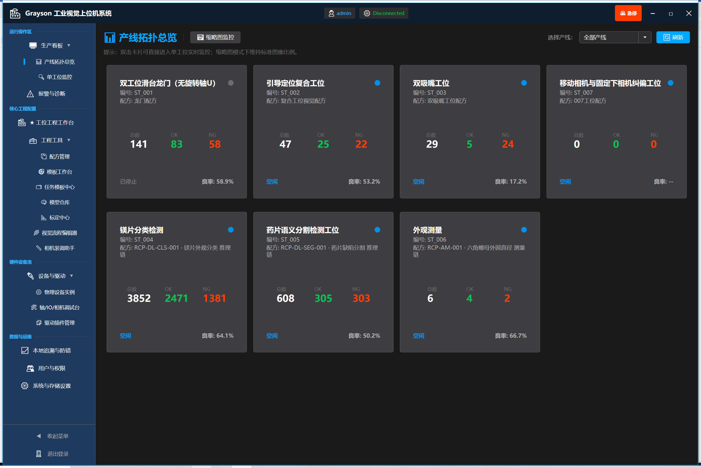
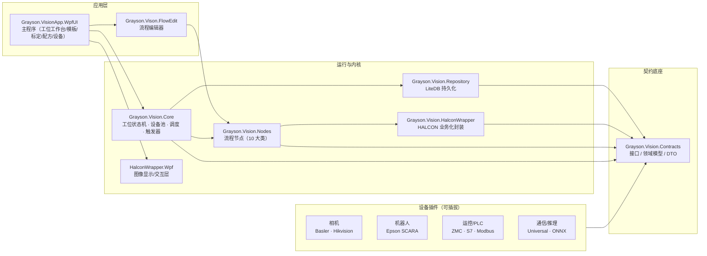

# Grayson.Vision.Host — 机器视觉工位装配平台（上位机）

<p align="center">
  
  
  
  
  
</p>

> 面向「视觉工位快速搭建 / 快速换型」的 C# + WPF 上位机平台：**流程可编排、设备可插拔、模板/标定/配方可配置、结果可追溯**。
> 单仓库多工程，视觉内核 HALCON，流程引擎与节点体系自研。

---

## 1. 项目简介

把「一套视觉检测 / 引导设备的工程搭建」从 **改代码** 变成 **配置 + 编排**：

- 视觉任务按**任务族**沉淀为可配置模板，换产品只动配方 / 模板 / 标定档案，不重编译；
- 相机、机械手、运动控制卡、PLC、推理引擎全部 **插件化**（接口契约在 `Contracts`，宿主零改动接入新设备）;
- 标定按**物理量建模**（手眼矩阵 H、偏心 e、对针 t、像素当量 s……），向导化采集、残差门禁、两级发布；
- 流程用**节点图**编排（采集 → 预处理 → 匹配 / 测量 → 坐标换算 → 设备动作 → 数据回传），编辑态与运行态共用同一份模型。

覆盖三类现场角色：

| 角色 | 关心什么 | 平台怎么满足 |
|---|---|---|
| 现场工程师 | 换产品/换工位少改代码 | 模板、标定档案、配方、工位配置全部配置化；流程用节点图编排 |
| 上位机/视觉开发 | 新相机/新机械手怎么接入 | `Contracts` 接口契约 + `Plugins.*` 插件化，宿主零改动 |
| 设备/产线 | 稳定、可查、能对接 MES | 工位状态机、工单追溯、数据追溯、MES 桥接、日志分级 |

---

## 2. 能力域总览

| 能力域 | 工业场景 | 状态 | 说明 |
|---|---|---|---|
| **视觉引导定位 · 取放** | 视觉引导机器人（VGR）取放料 | 🟢 引擎完整 · 真机调试中 | 成像→模板匹配→坐标换算→机械手联动取放；ETH / EIH 双布局 + 标定两级发布 |
| **深度学习质检** | 缺陷检测 / 分类 / 分割 | 🟢 端到端可跑 | HALCON DL 一站式（DLTool → .hdl → C# 集成）；内置分割/分类演示任务 |
| **外观尺寸测量** | 尺寸 / 几何量测量 | 🟢 纯软件可跑 | 卡尺+拟合测量链 → 像素当量换算 mm → 测量值±公差判 OK/NG |
| **多相机复合工位** | 贴装 / 组装「取-校-放」 | 🟡 在研 | 固定上相机 + 固定下相机 + 眼在手上相机；坐标系统一与视轴镜像处理 |
| **视觉任务模板中心** | 任务可配置化交付 | 🟢 已实现 | 三大任务族模板库 + 模型仓库；模板 = 选模板 + 绑设备 + 应用配方 |
| **扩展方向** | 3D 视觉 / 无监督异常检测 | ⚪ 规划 | 平台已预留节点与插件语义，按需扩展 |

---

## 3. 界面预览

> 📷 截图补充中：运行主程序后对「工位工作台 / 流程编辑器 / 标定向导」等亮点页面截图，保存到 `docs/images/` 并按下表命名即可自动展示。

<!--
| 主界面 | 流程编辑器 | 标定向导 |
|---|---|---|
|  |  |  |
-->

<details>
<summary>如何补充截图</summary>

1. 运行主程序（见 [快速开始](#7-快速开始)），进入「工位工作台 / 流程编辑器 / 标定向导」等页面截图；
2. 保存为 PNG 放入 `docs/images/`，文件名对应表格；
3. 取消上方注释块并提交，本节即自动渲染。

</details>

---

## 4. 系统架构



**依赖规则**：`Contracts` 不依赖任何上层；`Core / Repository / HalconWrapper` 不引 WPF、不引具体硬件 SDK；只有主程序与编辑器允许组合一切。

---

## 5. 解决方案结构

解决方案文件：`Grayson.Vision.Host.slnx`，共 17 个产品工程。

| 层 | 工程 | 类型 | 职责 |
|---|---|---|---|
| 契约底座 | **Grayson.Vision.Contracts** | 类库 | 接口/领域模型/DTO/枚举，全仓依赖最底层 |
| 数据 | **Grayson.Vision.Repository** | 类库 | LiteDB 持久化：工位配置/配方存储/历史仓储 |
| 运行 | **Grayson.Vision.Core** | 类库 | 工位运行宿主：状态机、设备池、调度、触发器、业务 Process |
| 视觉内核 | **Grayson.Vision.HalconWrapper** | 类库 | HALCON 业务化封装：模板/匹配/测量/标定/预处理 |
| 显示内核 | **Grayson.Vision.HalconWrapper.Wpf** | WPF 类库 | HALCON 图像 WPF 显示宿主/渲染/交互翻译层 |
| 节点 | **Grayson.Vision.Nodes** | 类库 | 流程节点实现 + 参数面板（10 大类节点） |
| 编辑器 | **Grayson.Vison.FlowEdit** | WinExe | 独立流程编辑器（拖节点/配参数/验流程） |
| 主程序 | **Grayson.VisionApp.WpfUI** | WinExe | 主界面壳：工位工作台/模板/标定/配方/设备/系统 |
| 相机 | **Plugins.Camera.Basler** | 插件 | Basler 相机 `ICamera` 实现（Pylon） |
| 相机 | **Plugins.Camera.Hikvision** | 插件 | 海康相机 `ICamera` 实现（MvCamCtrl） |
| 机械手 | **Plugins.Robot.Epson** | 插件 | Epson SCARA：RC+/SPEL/TCP 脚本三层通信适配 |
| 运动 | **Plugins.Motion.Zmc** | 插件 | ZMC 运动控制卡 `IMotionCard` 实现 |
| PLC | **Plugins.PLC.Siemens** | 插件 | 西门子 S7 通信插件 |
| 通信 | **Plugins.Protocol.Universal** | 插件 | 通用协议解析/指令策略（Modbus TCP / S7 / MC / FINS 策略族） |
| 推理 | **Plugins.Inference.OnnxRuntime** | 插件 | ONNX 推理 `IInferenceProvider`：YOLO/分类/异常检测 |

---

## 6. 核心概念（30 秒扫盲）

1. **工位（Station）= 运行载体**：一条产线上的一个视觉任务点。`StationConfigModel`（配置、触发源、流程键）→ `StationWorker`（状态机 + 驱动流程）→ 具体业务 `Process`。
2. **配方（Recipe）= 随产品变的工艺**：流程节点图 + 工艺参数 + 逻辑设备需求，JSON 落盘；发布分工位级与配方级，不直接下发设备。
3. **模板 / 标定 = 视觉资产**：模板源图留档可回溯；标定按物理量建模（H / e / t / s），状态机 `Draft→SampleComplete→Verified→Published|Expired`，向导采集 + 残差门禁。
4. **节点（Node）= 最小执行单元**：10 大类（图像输入/预处理/识别/定位标定/测量/数学逻辑/设备IO/流程控制/数据存储/复合组），同一节点实现既被编辑器可视化编排，也被运行时引擎调度执行。

---

## 7. 快速开始

```text
环境要求：Windows x64 · Visual Studio 2022 · .NET Framework 4.7.2 targeting pack · HALCON Runtime

1) 克隆仓库，打开 Grayson.Vision.Host.slnx
2) 平台选择 x64，生成解决方案
3) 外部原生依赖放入运行目录（部分随插件 Content 自动拷贝）：
   - halcondotnet.dll / halcon.dll（HALCON Runtime）
   - 相机 SDK 原生库（Basler pylon / 海康 MVS）
4) 运行目录：Grayson.VisionApp.WpfUI\bin\Debug\，主程序：Grayson.Vision.WpfUI.exe
5) 典型流程：建档工位 → 绑定设备 → 采图调成像 → 标定向导 → 编排配方 → 运行验证
```

### 开箱演示（无需真机）

`Assets/DLDemo`（DL 模型 + 精选图）与 `Assets/MeasureDemo`（测量素材）已随仓库入库，首次打开主程序「**任务模板中心**」自动落地演示任务：

- **深度学习质检**：药片分割 / 镁片分类 —— `.hdl` 模型 + 本地图源，纯软件执行；
- **外观测量**：六角螺母外圆直径 —— 拟合测量 → 像素当量换算 → 测量值±公差判 OK/NG，结果写入 `Config/DemoData/{station}.csv`。

---

## 8. 插件化扩展

新设备接入只需三步，宿主零改动：

```text
1. 新建类库工程，引用 Grayson.Vision.Contracts
2. 实现对应能力接口：ICamera / IMotionCard / IPlc / IIoDevice / IInferenceProvider …
3. 编译输出放入主程序运行目录，插件加载器按「接口 + 特性」双重筛选自动注册
```

---

## 9. 顶层目录导览

```text
Grayson.Vision.Host/
├─ Grayson.Vision.Contracts/          契约层（接口/模型/DTO）
├─ Grayson.Vision.Core/               工位运行宿主与业务 Process
├─ Grayson.Vision.Repository/         LiteDB 持久化
├─ Grayson.Vision.HalconWrapper/      HALCON 封装（无 WPF）
├─ Grayson.Vision.HalconWrapper.Wpf/  HALCON 显示宿主/交互层
├─ Grayson.Vision.Nodes/              流程节点实现
├─ Grayson.Vison.FlowEdit/            流程编辑器
├─ Grayson.VisionApp.WpfUI/           主程序（View/ViewModel/Service/Assets）
├─ Plugins.Camera.Basler|Hikvision/   相机插件
├─ Plugins.Robot.Epson/               机械手插件
├─ Plugins.Motion.Zmc/                运控卡插件
├─ Plugins.PLC.Siemens/               PLC 插件
├─ Plugins.Protocol.Universal/        通用通信插件
├─ Plugins.Inference.OnnxRuntime/     AI 推理插件
├─ DLLLib/                            第三方托管 dll 汇集（halcondotnet 等）
└─ docs/                              文档与截图（含 images/）
```

---

## 10. 路线图

- 🟢 **已实现**：标定向导 v2、配方两级发布、流程编排、模板源图留档、设备插件体系、DL 质检、外观测量、任务模板中心；
- 🟡 **进行中**：多相机复合工位（上相机 + 下相机 + EIH）标定链路与业务模板、引导定位真机端到端闭环；
- ⚪ **规划**：3D 视觉（双目 / 结构光 / 点云算子）、无监督异常检测。

---

## 许可

本项目未附带开源许可证，代码与资料仅供学习交流使用。
